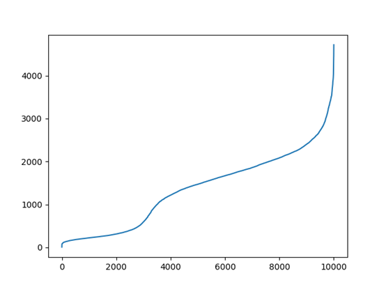
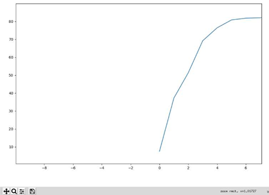
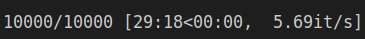

### 孙正茂 2020-07-08
### 摘要：   
我认为三维点的核心在于点坐标的描述子，如果能准确快速的对点进行描述，就可以实现后面很多核心的任务。    
实现了FPFH描述子，测试的时候对modelnet中的模型做一个旋转，取旋转前后的两个对应点坐标P_anchor和P_pos，分别提取描述子，再取一个其他的点提取描述子作为P_neg，对这三个点分别提取描述子，计算两两之间的距离。  
### 过程： 
(1)选取chair作为model，如下图所示，黄色为选取的特征点P_anchor和P_pos，蓝色为P_neg.   
   

(2)下表记录了这三个特征点处的描述子   
| | P_anchor | P_pos | P_neg 
| --- |--- | --- | ---
1|	180.897137|	176.0708894	|203.3005755
2|	213.3081034 |211.0922203    |183.9787028
3|	342.177696	|342.1775528	|268.0386161
4|	227.8610058	|230.0766508	|181.7247573
5|	182.5903076	|187.4162867	|211.3020917
6|	52.91067005	|52.91064434	|42.54701256
7|	268.432122	|268.4319618	|238.0473095
8|	421.4722679	|421.4720701	|386.0642481
9|	329.5758581	|329.5755962	|315.9957079
10|	74.44333175	|74.44332769	|65.69046527
11|	80.5732706	|80.57321254	|120.2663953
12|	133.1021744	|133.1021001	|111.890464
13|	580.8216587	|580.8213637	|525.7879888
14|	234.6313674	|234.6312429	|192.6824387
15|	117.7057787	|117.7056808	|97.7174566    

(3)对上述三个点分别计算描述子距离，用二范数表示:   
similar_dist | different_dist | different_dist 
---| ---|---
7.510|139.895|140.144
因此可以看出，FPFH对旋转是不敏感的。   

(4)将旋转之前的第一个点与旋转之后的每个点计算描述子的距离，得下图

(5)对时间进行测试:

该程序使用了字典记录每个点的法向量，因此可以快一些，每秒可以计算5.69个描述子。